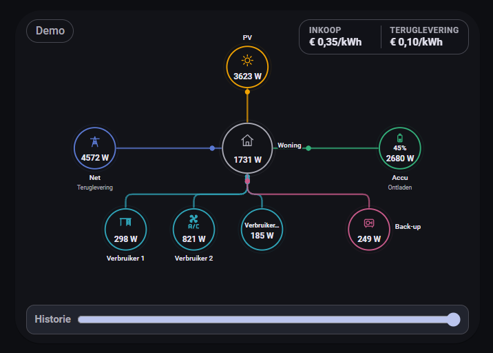
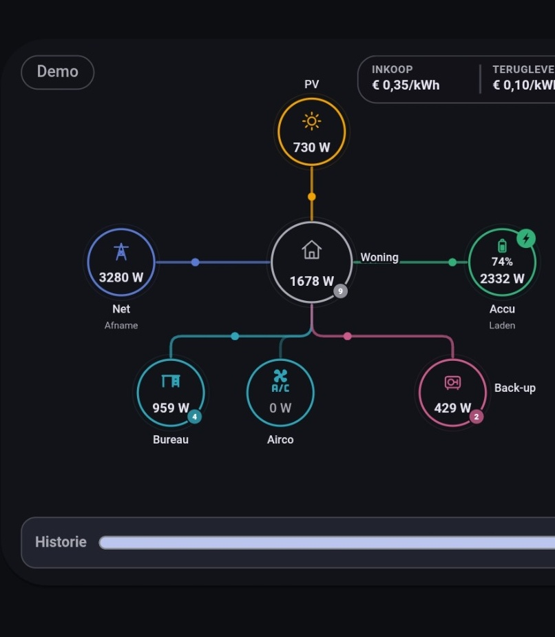

# Energy Flow Card Pro

Energy Flow Card Pro is a custom Home Assistant Lovelace card for **live energy flows, device-level power, historical replay, diagnostics, hierarchical consumer branches, three-phase Grid details and optional electricity pricing**.

It is designed to scale from a simple **Home / Grid / PV / Battery** overview to larger setups with **grouped devices, branch drill-down, replay and per-node history popups**.

<p align="center">
  
</p>

## Highlights

- Live animated energy-flow lines
- Responsive desktop, tablet and mobile layout
- 24-hour per-node history popups
- Whole-card 24-hour replay
- Hierarchical consumers (for example `Desk -> power strip -> PC / PS5 / TV`)
- Warning badges and diagnostics that propagate up the branch tree
- Optional groups with summed power and shared history
- Optional Grid L1/L2/L3 graph with phase power, voltage and current support
- Automatic calculated **L1** fallback for meters that expose total + L2 + L3 only
- Optional pricing with fixed tariffs or Home Assistant price entities
- Home energy/cost statistics for **today / this week / this month**
- Demo mode for safe testing without sensors
- Dutch and English UI following the Home Assistant frontend language
- Curated color presets in the visual editor

## Quick look

<table>
  <tr>
    <td align="center"><strong>Mobile overview</strong></td>
    <td align="center"><strong>Hierarchy focus</strong></td>
    <td align="center"><strong>Three-phase Grid popup</strong></td>
  </tr>
  <tr>
    <td></td>
    <td></td>
    <td></td>
  </tr>
</table>

## Installation

### HACS (recommended)

Energy Flow Card Pro can be installed as a **HACS custom Dashboard repository**.

1. Open **HACS** in Home Assistant.
2. Open **Custom repositories**.
3. Add:

   ```text
   https://github.com/Joost05/energy-flow-card-pro
   ```

4. Select category **Dashboard**.
5. Install **Energy Flow Card Pro**.
6. Reload the Home Assistant frontend if requested.

HACS manages the frontend resource for you and installs:

```text
energy-flow-card-pro.js
```

### Card type

Use the card picker/editor, or create the card in YAML with:

```yaml
type: custom:energy-flow-card-pro
```

For a quick working preview:

```yaml
type: custom:energy-flow-card-pro
demo: true
```

## Manual installation

HACS is recommended, but manual installation is also supported.

1. Download `energy-flow-card-pro.js` from the latest GitHub release.
2. Copy it to a folder under `/config/www/`, for example:

   ```text
   /config/www/energy-flow-card-pro/energy-flow-card-pro.js
   ```

3. Add the Lovelace resource:

   ```text
   /local/energy-flow-card-pro/energy-flow-card-pro.js
   ```

4. Add the card with:

   ```yaml
   type: custom:energy-flow-card-pro
   ```

> Do not keep a manual resource active at the same time as the HACS-installed resource.

## Quick start

The visual editor is the recommended way to configure the card.

Home is created automatically. A small manual example:

```yaml
type: custom:energy-flow-card-pro
nodes:
  - name: Grid
    type: grid
    power_entity: sensor.grid_power

  - name: Solar
    type: solar
    power_entity: sensor.solar_power

  - name: Battery
    type: battery
    power_entity: sensor.battery_power

  - name: Desk
    type: consumer
    power_entity: sensor.desk_power
```

If `connections` is omitted, the normal **Home-centered topology** is built automatically.

## Hierarchical consumers

A parent device can represent a measured total, while child devices show the detailed breakdown behind it.

```yaml
nodes:
  - id: desk
    name: Desk
    type: consumer
    power_entity: sensor.desk_power

  - id: strip
    name: Power strip
    type: consumer
    power_entity: sensor.power_strip_power
    connected_to: desk

  - name: Computer
    type: consumer
    power_entity: sensor.pc_power
    connected_to: strip

  - name: TV
    type: consumer
    power_entity: sensor.tv_power
    connected_to: strip

  - name: 3D Printer
    type: consumer
    power_entity: sensor.printer_power
    connected_to: desk
```

Child devices are a **breakdown of the parent branch** and are not double-counted at Home level.

Parent nodes can show a **descendant count badge**, and warnings in deep child devices propagate upward so you can still spot problems from the main card.

## History and replay

Energy Flow Card Pro preloads one bundled 24-hour history set and caches it for fast graph opening.

- Click a node to open its 24-hour history popup.
- Hover on desktop or tap/drag on touch devices to inspect a specific moment.
- Use the Replay slider on the main card to inspect the **entire energy flow** at an earlier point in the last 24 hours.
- Press **Live** to return to current values.

Recorder history must be available for the relevant entities.

## Pricing and energy statistics

Supported pricing modes:

- none
- fixed import/export tariffs
- Home Assistant import/export price entities

The Grid popup can show:

- live import/export price
- cost at this moment
- signed daily financial result (`export revenue - import cost`)

The Home popup can show **Today / This week / This month** energy and cost statistics when enough energy counters are configured.

## Diagnostics

Diagnostics are available per node and are designed to make sensor/data issues easy to spot.

<table>
  <tr>
    <td align="center"><strong>Warning badges on the card</strong></td>
    <td align="center"><strong>Diagnostic popup example</strong></td>
  </tr>
  <tr>
    <td></td>
    <td></td>
  </tr>
</table>

The card can flag:

- missing power entities
- `unknown` or `unavailable` states
- stale primary power sensors
- measurable Home energy-balance differences
- warnings or errors in descendants of a hierarchical consumer branch

## Visual editor

The built-in visual editor is the easiest way to add devices, assign entities, configure groups, colors, pricing and preview the layout.

<p align="center">
  
</p>

## Documentation

- [Configuration reference](docs/configuration.md)
- [Troubleshooting](docs/troubleshooting.md)
- [Migration and upgrades](docs/migration.md)
- [Release process](docs/releasing.md)
- [Documentation index](docs/README.md)
- [Changelog](CHANGELOG.md)

## Migration from the older technical name

Before v0.17.0 the project used:

```text
energy-flow-card.js
custom:energy-flow-card
```

The current technical identifiers are:

```text
energy-flow-card-pro.js
custom:energy-flow-card-pro
```

If you were using the older manual resource, remove the old resource before switching to the new HACS-managed installation.

## Support

When reporting an issue, include:

- Energy Flow Card Pro version
- Home Assistant version
- whether the issue is on desktop, tablet or mobile
- a screenshot of the problem
- the relevant card configuration (private entity names can be masked)
- browser/app console errors if available
