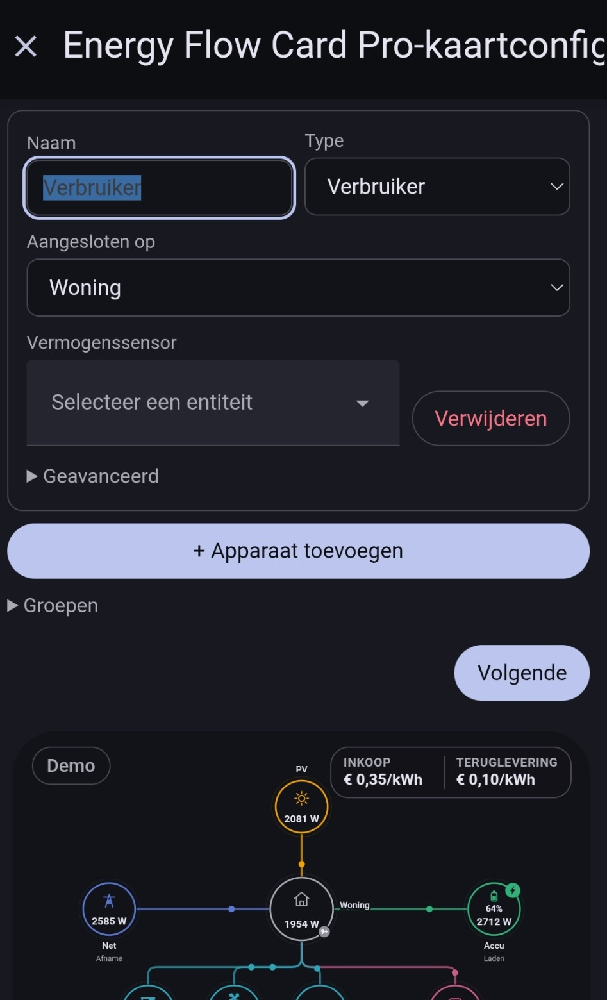
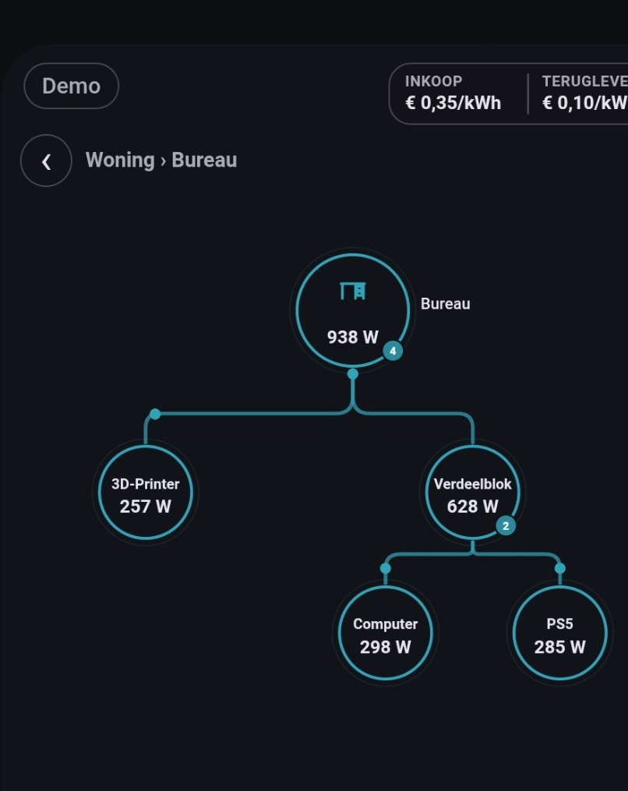
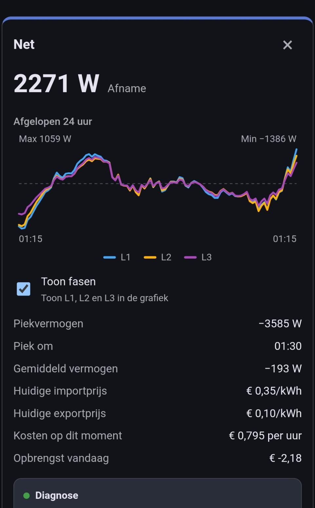

# Configuration reference

Energy Flow Card Pro is designed to be configured primarily from the **Home Assistant visual editor**. YAML is optional, but useful for backups, advanced setups and troubleshooting.

<p align="center">
  
</p>

## Card type

```yaml
type: custom:energy-flow-card-pro
```

The **Home** node is created automatically. You do not need to add a separate `home` node in normal use.

## Minimal example

```yaml
type: custom:energy-flow-card-pro
nodes:
  - name: Grid
    type: grid
    power_entity: sensor.grid_power
  - name: Solar
    type: solar
    power_entity: sensor.solar_power
  - name: Battery
    type: battery
    power_entity: sensor.battery_power
```

Without an explicit `connections` section, Energy Flow Card Pro creates the normal **Home-centered** flow automatically.

## Top-level options

| Option | Type | Default | Description |
| --- | --- | --- | --- |
| `type` | string | required | Must be `custom:energy-flow-card-pro`. |
| `title` | string | empty | Optional card title. |
| `demo` | boolean | `false` | Enables built-in demo data when no real nodes are configured. |
| `animation` | boolean | `true` | Enables animated flow indicators. |
| `power_format` | `w`, `kw`, `auto` | `w` | Power display format. |
| `max_power` | number | `5000` | Reference value used for flow scaling. Must be greater than zero. |
| `animation_speed` | number | `1` | Global flow animation speed multiplier. Must be greater than zero. |
| `home_power_entity` | entity id | none | Optional independent Home power sensor. If omitted, Home is calculated. |
| `nodes` | list | empty | Energy devices shown by the card. |
| `groups` | list | empty | Optional display groups. |
| `connections` | list | automatic | Optional manual connection definitions. |
| `layout` | object | `flow` | Layout configuration. |
| `pricing` | object | none | Optional electricity pricing. |
| `colors` | object | defaults | Optional category color overrides. The editor offers a curated preset palette. |

## Supported node types

Supported canonical node types:

- `grid`
- `solar`
- `battery`
- `consumer`
- `producer`
- `generator`
- `ev_charger`
- `heat_pump`
- `boiler`
- `airco`
- `backup`

The editor may accept some familiar aliases internally, but public YAML examples should use the canonical names above.

## Common node options

```yaml
nodes:
  - id: desk
    name: Bureau
    type: consumer
    icon: mdi:desk
    power_entity: sensor.desk_power
    invert: false
```

| Option | Description |
| --- | --- |
| `id` | Optional stable id. If omitted, one is generated from the name. |
| `name` | Display name. Required for normal user-created nodes. |
| `type` | Node type. |
| `icon` | Optional MDI icon, for example `mdi:desktop-tower`. |
| `power_entity` | Primary live power sensor. |
| `invert` | Reverses the sign of the primary power sensor. |
| `connected_to` | For consumers only: connect behind Home, Backup or another consumer. |
| `entities` | Optional extra entities used for advanced measurements or detail popup values. |

## Hierarchical consumers

A parent node can represent the measured total of a branch, with child consumers as the breakdown behind it.

```yaml
nodes:
  - id: desk
    name: Bureau
    type: consumer
    power_entity: sensor.desk_power

  - id: strip
    name: Verdeelblok
    type: consumer
    power_entity: sensor.power_strip_power
    connected_to: desk

  - name: Computer
    type: consumer
    power_entity: sensor.pc_power
    connected_to: strip

  - name: PS5
    type: consumer
    power_entity: sensor.ps5_power
    connected_to: strip

  - name: 3D-printer
    type: consumer
    power_entity: sensor.printer_power
    connected_to: desk
```

Important behavior:

- child devices are a **breakdown of the parent** and are not double-counted at Home level;
- parent nodes can show a **descendant count badge**;
- warnings in descendants propagate upward;
- loops such as `A -> B -> A` are rejected.

<p align="center">
  
</p>

## Groups

Groups are optional visual aggregations for compatible devices.

Typical uses:

- several room consumers shown as one combined item;
- a pair of similar loads shown as a single display node;
- a cleaner top-level overview while still allowing per-node detail popups elsewhere.

Grouped display rules:

- at least two members are required;
- members must have compatible roles;
- members must share the same parent connection;
- a parent consumer that still has child consumers cannot be hidden inside a visible group;
- the same node cannot belong to multiple visible groups.

## Grid phase configuration

Grid can optionally use separate L1/L2/L3 sensors.

The Grid popup can show a combined three-phase graph and optional voltage/current values.

<p align="center">
  
</p>

Useful for meters such as some HomeWizard P1 setups:

- if **L1 power** is missing,
- but total Grid power, **L2** and **L3** are available,
- leave L1 empty and the card will calculate it as:

```text
L1 = total - L2 - L3
```

The popup labels this value as calculated.

## Pricing

Supported pricing modes:

### 1. None
No price information is shown.

### 2. Fixed import/export tariffs
Useful for static day/night or simple fixed-price setups.

### 3. Home Assistant price entities
Useful for dynamic pricing setups where the import/export price is represented by sensor entities.

Grid details can show:

- current import price
- current export price
- cost at this moment
- signed daily Grid result (`export revenue - import cost`)

## Home statistics

The Home popup can show **Today / This week / This month** values when sufficient energy counters are configured.

Depending on the available data, this can include:

- Home consumption
- Grid import/export
- solar production
- import cost
- feed-in revenue
- net cost
- self-consumption
- self-sufficiency

The card does not invent missing historical values. If enough source data is not available, the derived value is omitted.

## Colors

The visual editor includes a curated palette of readable preset colors plus the default color for each energy type.

The goal is to keep the card visually clear and consistent without overwhelming the user with unrestricted color selection.

## Layout

The main layout modes are:

- **Flow** — the default and most adaptive layout
- **Straight**
- **Round**

Flow is recommended for most installations, especially larger setups and hierarchical branches.

## History and replay requirements

Per-node history graphs and whole-card replay both depend on usable Home Assistant Recorder history.

Check that:

- Recorder is enabled;
- the relevant entities are not excluded;
- the entities have at least some usable historical states.

## Practical starter example

```yaml
type: custom:energy-flow-card-pro
demo: false
pricing:
  import_price_entity: sensor.electricity_import_price
  export_price_entity: sensor.electricity_export_price
nodes:
  - name: Net
    type: grid
    power_entity: sensor.p1_vermogen
    entities:
      l2_power: sensor.p1_vermogen_fase_2
      l3_power: sensor.p1_vermogen_fase_3
      l1_voltage: sensor.p1_spanning_fase_1
      l2_voltage: sensor.p1_spanning_fase_2
      l3_voltage: sensor.p1_spanning_fase_3
  - name: PV
    type: solar
    power_entity: sensor.pv_power
  - name: Accu
    type: battery
    power_entity: sensor.battery_power
  - id: desk
    name: Bureau
    type: consumer
    power_entity: sensor.desk_power
  - name: 3D Printer
    type: consumer
    power_entity: sensor.printer_power
    connected_to: desk
```
