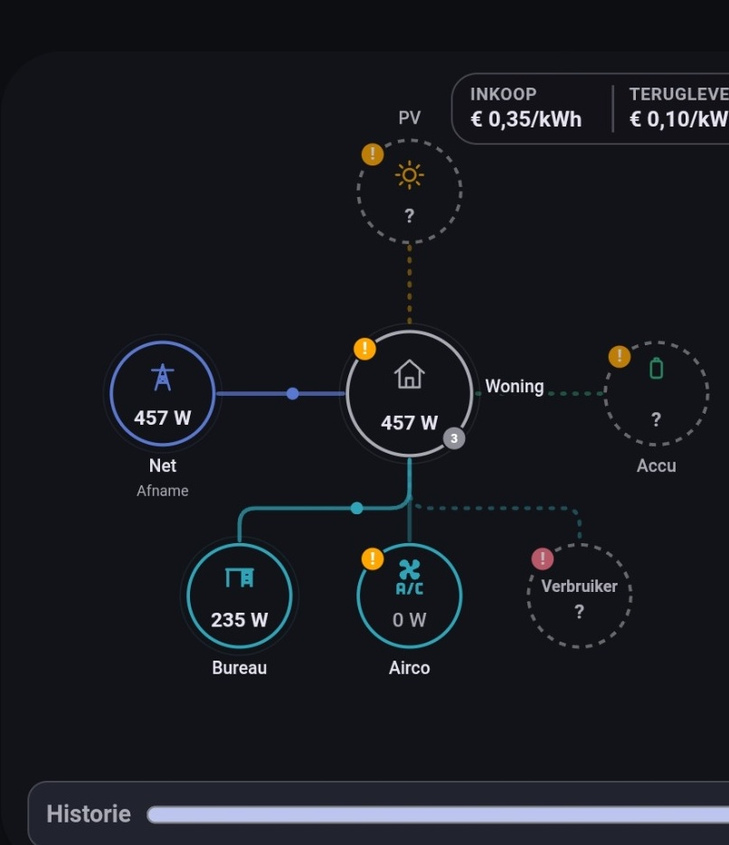
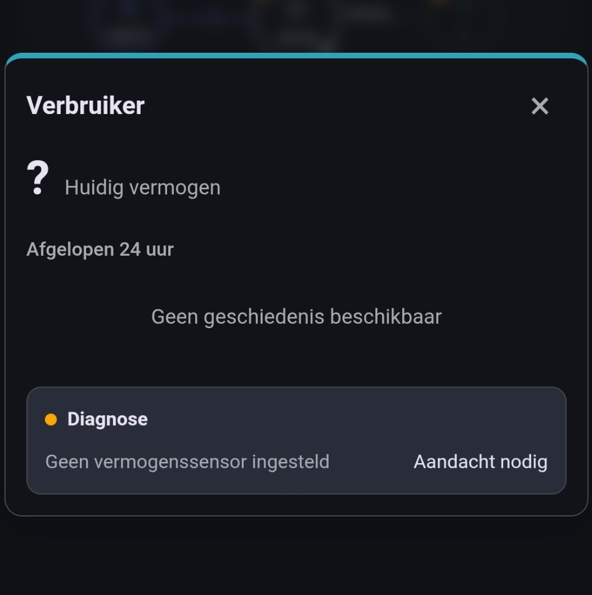

# Troubleshooting

If Energy Flow Card Pro is installed but not behaving as expected, use this guide to narrow down the cause.

## First checks

Before going deep, verify:

- the correct card type is used:

  ```yaml
  type: custom:energy-flow-card-pro
  ```

- the expected resource is loaded (`energy-flow-card-pro.js`);
- the Home Assistant frontend has been reloaded after installing/updating;
- you do not have both a manual resource and an HACS-managed resource active.

## HACS update does not appear

Common causes:

- the GitHub release was created without the expected asset;
- HACS has cached the old repository information;
- the repository is installed manually and not actually through HACS;
- an old manual resource is still shadowing the HACS-managed file.

Try:

1. open the repository inside HACS;
2. use **Update information** or refresh the repository;
3. confirm the GitHub release contains `energy-flow-card-pro.js` under **Assets**;
4. fully reload the frontend/app;
5. remove old manual Lovelace resources if present.

## The card does not load after migrating from the old name

From v0.17.0 onward, the technical identifiers are:

```text
energy-flow-card-pro.js
custom:energy-flow-card-pro
```

If you still reference the old identifiers:

```text
energy-flow-card.js
custom:energy-flow-card
```

Home Assistant will not load the new card correctly.

See [migration.md](migration.md).

## I see warning badges on the main card

That usually means one or more nodes have diagnostics that require attention.

<p align="center">
  
</p>

Open the relevant node popup and inspect **Diagnostics**.

<p align="center">
  
</p>

Possible causes include:

- missing power entity;
- `unknown` or `unavailable` state;
- stale primary power sensor;
- measurable Home balance mismatch;
- a warning/error in a descendant of a hierarchical branch.

Problems in deeper child devices intentionally propagate upward so you can still see them on the main card.

## A sensor is reported as stale

Energy Flow Card Pro flags a primary power sensor when it has not updated for roughly 15 minutes.

Some integrations only update when the measured value changes. If so, first verify whether the source integration is expected to stay quiet during stable periods.

## No 24-hour history is available

The entity must exist in Home Assistant Recorder history.

Check that:

- Recorder is enabled;
- the sensor is not excluded from Recorder;
- the entity has historical states;
- the entity id has not recently changed.

## Replay says there is not enough history

Replay needs usable historical power data across the card.

Check the same Recorder conditions as for the 24-hour graphs.

Demo mode contains its own synchronized sample history and should work even without Recorder.

## Touch-dragging a graph does not work correctly

Version 0.16.0 and later use pointer-based touch handling.

If touch inspection behaves like page scrolling instead:

- confirm you are on v0.16.0 or newer;
- fully reload the Home Assistant app/browser after updating;
- verify that HACS is not still loading an older cached resource.

## L1 power is missing from my meter

Some meters expose:

- total Grid power,
- L2 power,
- L3 power,

but no separate L1 power sensor.

Leave the L1 power field empty and configure total, L2 and L3. The card calculates:

```text
L1 = total - L2 - L3
```

The Grid popup labels the value as calculated.

## Prices are shown but period cost is missing

Live prices and period cost calculations use different data sources.

Period cost/revenue requires enough historical energy information. For week and month statistics, configure cumulative import/export counters. Dynamic/entity pricing also requires usable historical price states for precise period calculations.

If the required data is missing, the card omits the derived value instead of estimating it.

## Revenue today is negative

This is expected.

The displayed daily Grid result is signed:

```text
export revenue - import cost
```

An import-only day can therefore produce a negative result.

## Home power does not match my meter

If `home_power_entity` is not configured, Home is calculated from the configured flows.

If an independent Home power sensor is configured, Diagnostics can compare it with the measurable source-side balance. A difference above the built-in tolerance is shown as a warning.

## “Other / unmetered consumption” is larger than expected

This value is the part of Home load that is not represented by configured consumer nodes.

Check for:

- missing consumer nodes;
- wrong sign/invert settings;
- a device connected to the wrong parent;
- stale or unavailable child sensors.

For hierarchical branches, child devices are not counted a second time at Home level. The parent measurement is treated as the branch total.

## A grouped node gives an error

Visible grouped nodes have several constraints:

- at least two members;
- compatible roles;
- same parent connection;
- a parent node with its own child consumers cannot be hidden inside a grouped node;
- the same device cannot be in more than one visible grouped node.

## A `connected_to` configuration is rejected

`connected_to` is only valid for consumer-type devices. It can point to:

- Home;
- Backup;
- another consumer.

The card rejects self-references and loops such as `A -> B -> A`.

## The mobile card becomes very small with many devices

Version 0.16.0 and later uses mobile focus navigation for large hierarchies.

Instead of trying to render the full installation at unreadably small scale, you can open a branch such as **Bureau** and focus on that subtree.

## Still stuck?

When reporting an issue, include:

- Energy Flow Card Pro version;
- Home Assistant version;
- whether the issue is on desktop, tablet or mobile;
- a screenshot of the problem;
- the relevant card configuration (private entity names can be masked);
- browser console/app error text if available.
